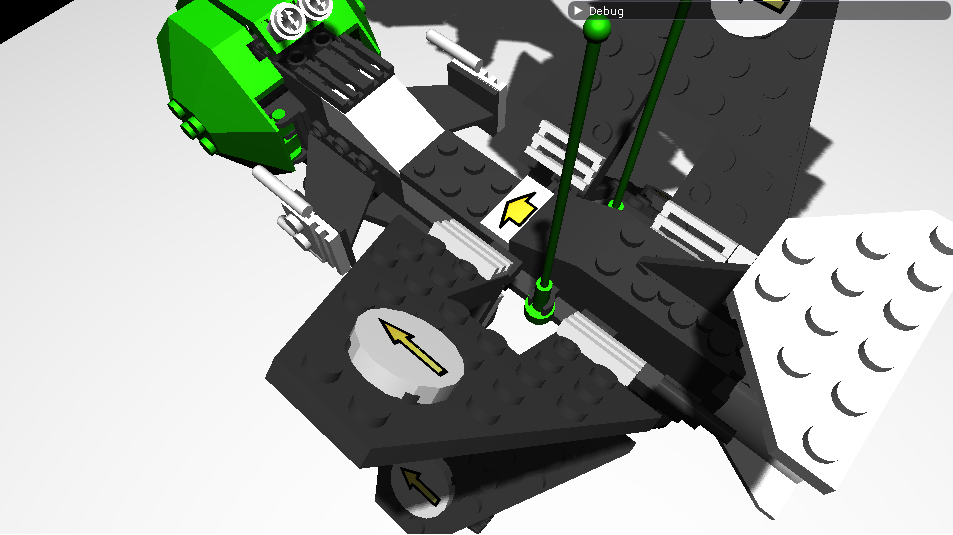

# Project for Computer Grapgics 2 class

Project using OpenGL providing a basic overview of real time rendering possibilities

	- loading obj and mtl files
	- PBR shader
	- calculation of tangents and bitangents
	- support for normal maps using TBN
	- shadow mapping
	- shadows using stencil buffer

 
